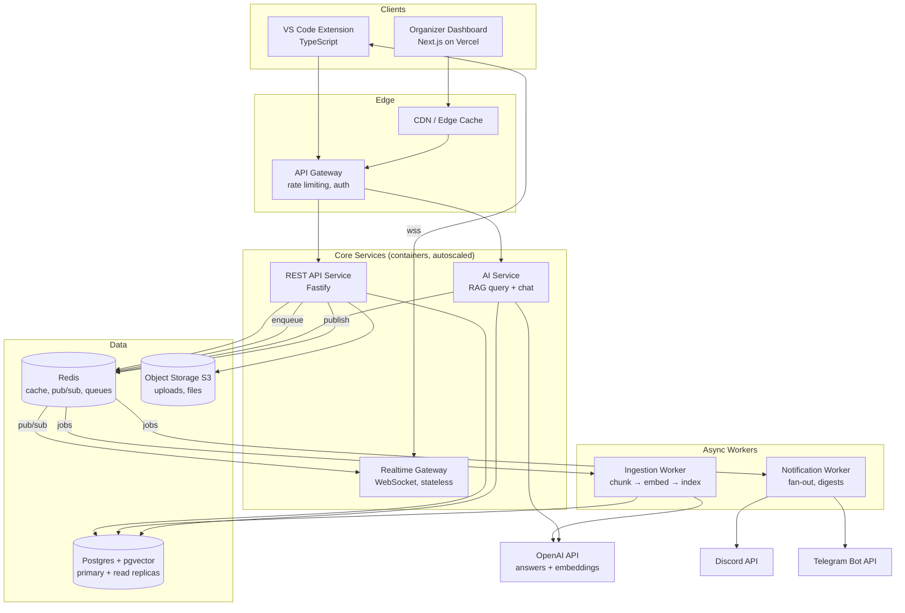

# Production Architecture — AI-Powered IDE-Native Hackathon Platform

This document defines the production architecture, the chosen stack with rationale, and how each part scales. It is the production evolution of the MVP stack in `build-plan.md` — same technologies where possible, so nothing gets thrown away moving from MVP to production.

---

## 1. Architecture at a Glance



**Shape:** a modular monolith for the API plus three purpose-split services (realtime, AI, workers). Not microservices — service boundaries exist only where scaling characteristics genuinely differ (long-lived sockets, LLM latency, background jobs). This is the right size for a small team and scales to tens of thousands of concurrent participants before anything needs to be split further.

---

## 2. Stack Decisions & Rationale

| Concern | Choice | Why it's the best fit |
|---|---|---|
| Web dashboard | **Next.js 15 (App Router) on Vercel** | SSR for fast dashboard loads, edge caching for public event pages, zero-ops deploys. Organizer traffic is spiky (event start/end) — Vercel absorbs it. |
| API service | **Node.js + Fastify (TypeScript)** | One language across extension, web, and API; shared types in a monorepo package. Fastify over Express for 2–3× throughput and first-class schema validation (TypeBox/Zod). |
| Realtime | **Dedicated WebSocket gateway (Node + `ws`), Redis pub/sub backplane** | Long-lived connections have opposite scaling needs from request/response — isolate them so API deploys never drop sockets. Stateless gateway nodes scale horizontally behind the LB; Redis pub/sub fans announcements out to every node. |
| Database | **Postgres (managed: Supabase / RDS / Neon)** | Relational fits the domain (events → resources → announcements → teams → submissions). Row-Level Security gives clean multi-tenancy. Read replicas handle read-heavy participant traffic. |
| Vector store | **pgvector (in the same Postgres)** | Event corpora are small (thousands of chunks per hackathon, not billions). pgvector with an HNSW index is more than enough, keeps vectors transactionally consistent with source rows, and avoids operating a second datastore. Revisit only past ~10M vectors. |
| Cache / queue / pub-sub | **Redis (managed: Upstash / ElastiCache)** | One component, three jobs: hot-content cache, announcement pub/sub backplane, and BullMQ job queues. Standard, boring, well-understood. |
| Background jobs | **BullMQ workers (Node)** | Document ingestion (chunk → embed → index) and notification fan-out must be async and retryable. BullMQ gives retries, backoff, dead-letter queues, and a dashboard, without adding Kafka-scale ops. |
| File storage | **S3-compatible object storage + CDN** | Uploaded PDFs, images, sponsor assets. Presigned URLs so files never pass through the API. |
| AI | **OpenAI API — `gpt-4o` for RAG answers, `gpt-4o-mini` for summaries/classification, `text-embedding-3-small` for embeddings** | GPT-4o for quality cited answers; 4o-mini for cheap high-volume tasks (announcement digests, question clustering). `text-embedding-3-small` is cheap and strong enough for per-event corpora. OpenAI's automatic prompt caching on the shared event-context prefix cuts cost. Single API key, one provider SDK. |
| Auth | **Full sign-up/sign-in for organizers AND participants — email+password and OAuth (GitHub/Google); JWT access + refresh tokens** | One account works across events; participants join a specific hackathon by redeeming an invite code against their account. The extension authenticates via OAuth device flow or email login and stores tokens in VS Code SecretStorage. Stateless tokens keep the API and realtime gateway horizontally scalable. |
| External channels | **Discord bot + Telegram bot, driven by the notification worker** | Organizers connect Discord (bot invite + channel pick) and Telegram (bot added to group) from the dashboard; every announcement fans out to connected channels via queued jobs with retries — one publish, all channels. Bots are outbound-only broadcast in v1 (no ingestion), keeping the platform the source of truth. |
| Containers / deploy | **Docker on a managed platform (Fly.io / Render / ECS Fargate)** | Autoscaling containers without Kubernetes overhead. Kubernetes is not justified at this team size. |
| Observability | **OpenTelemetry → Grafana Cloud (or Datadog); Sentry for errors** | Traces across API → queue → worker → OpenAI call are essential for debugging RAG latency. |

---

## 3. Component Detail

### 3.1 API Service (modular monolith)

Modules with clear internal boundaries (each could be extracted later):

- **Events** — hackathon CRUD, invite codes, timeline
- **Content** — resources, announcements, versioning; writes enqueue ingestion jobs
- **Participants & Teams** — join flow, team membership
- **Submissions** — project submission records, deadline enforcement
- **Auth** — sign-up/sign-in (email+password, OAuth for web, OAuth device flow for the extension), token issuing/refresh, RBAC (organizer / mentor / participant), invite-code redemption binding a user to a hackathon
- **Integrations** — Discord/Telegram connection lifecycle: OAuth/bot-invite flow, channel mapping, per-integration settings, delivery logs

Conventions:
- All endpoints scoped by `hackathon_id`; RLS enforces tenant isolation at the DB layer as defense in depth.
- Idempotency keys on mutating endpoints (extension retries on flaky conference Wi-Fi).
- Cursor-based pagination everywhere; no offset pagination.
- OpenAPI spec generated from route schemas → typed client SDK consumed by both web and extension.

### 3.2 Realtime Gateway

- Participant connects with JWT → subscribes to `hackathon:{id}` channel.
- API publishes events (`announcement.created`, `resource.updated`, `deadline.changed`) to Redis; every gateway node forwards to its local sockets.
- Heartbeat + auto-reconnect with exponential backoff in the extension; on reconnect the extension calls a `/sync?since=<cursor>` endpoint so missed events are replayed — **polling remains the fallback path**, so realtime is an enhancement, never a single point of failure.
- Sticky sessions not required (any node can serve any client) — enables plain round-robin LB and zero-downtime rolling deploys.

### 3.3 AI Service

Split from the main API because LLM calls are slow (seconds) and would poison API latency percentiles and connection pools.

**Ingestion path (async, via workers):**
1. Content created/updated → `ingest` job enqueued.
2. Worker normalizes (markdown preferred; PDF → text extraction), chunks by heading with overlap, embeds, upserts into pgvector with metadata `{hackathon_id, resource_id, section, version}`.
3. Old chunks for the resource version are tombstoned atomically — participants never retrieve stale rules.

**Query path (sync, streaming):**
1. Extension sends question → embed → hybrid retrieval (pgvector similarity + Postgres full-text, reciprocal-rank fusion) filtered by `hackathon_id`.
2. Top-k chunks + question → GPT-4o with a strict system prompt: answer only from provided context, cite `resource_id` per claim, refuse when the corpus doesn't cover it.
3. Response streams to the extension via SSE; citations rendered as links that open the source resource in the IDE.
4. Semantic cache in Redis (embedding-similarity match on recent Q&A per event) — hackathon questions are highly repetitive ("what's the deadline?"), expect a high hit rate and large cost savings.
5. Every Q&A logged (with consent) → powers auto-FAQ generation and the organizer's "most asked questions" analytics.

### 3.4 External Channel Broadcast (Discord & Telegram)

Runs inside the notification worker — no separate service needed.

**Connect flow (dashboard):**
- Discord: organizer clicks "Connect Discord" → bot invite via Discord OAuth2 (`bot` scope) → organizer picks target channel(s) → guild/channel IDs stored on an `integrations` row.
- Telegram: dashboard shows the platform bot handle + a one-time linking code → organizer adds the bot to their group/channel and posts the code → bot resolves `chat_id` and completes the link.

**Broadcast flow:**
1. `announcement.created` → API enqueues one `broadcast` job per active integration (alongside the existing IDE realtime publish).
2. Worker formats per channel (Discord embed / Telegram HTML message) with priority marker + deep link back to the platform, then calls the Discord/Telegram API.
3. Retries with exponential backoff honoring each API's rate-limit headers; permanent failures (bot kicked, channel deleted) mark the integration `broken` and surface on the dashboard.
4. Delivery result appended to `integration_deliveries` → dashboard delivery log.

Per-integration filters (e.g., "only high-priority to Telegram") are evaluated at enqueue time. v1 is outbound-only: the bots broadcast but do not ingest Discord/Telegram messages, so the platform remains the single source of truth.

### 3.5 VS Code Extension

- Thin client: typed SDK + WebSocket subscription + webviews (chat, resource reader). No business logic client-side.
- Local cache of synced resources (workspace storage) → offline reading, instant startup, `since`-cursor delta sync.
- Tokens in VS Code SecretStorage; no secrets in settings files.
- Ships via VS Code Marketplace + Open VSX; API is versioned (`/v1`) so old extension versions keep working.

---

## 4. Data Model (core)

```
organizations 1─n hackathons 1─n resources ──1─n resource_chunks (pgvector)
                        │ 1─n announcements
                        │ 1─n timeline_items
                        │ 1─n teams 1─n team_members n─1 users
                        │ 1─n submissions
                        │ 1─n qa_logs        (asked questions → auto-FAQ, analytics)
                        │ 1─n invite_codes   (scoped, expirable, revocable)
                        └ 1─n integrations   (discord|telegram, channel ids, filters, status)
                                └ 1─n integration_deliveries (announcement_id, status, error)
```

Key choices:
- `resources.version` increments on edit; chunks carry the version → consistent retrieval during re-ingestion.
- `qa_logs` is append-only and partitioned by month → cheap analytics, easy retention policy.
- Everything cascades from `hackathon_id` → tenant isolation, simple archival (event ends → export + cold storage).

---

## 5. Scalability Model

Traffic profile is **extremely bursty**: near-zero between events, sharp spikes at kickoff, deadline, and announcement moments. The architecture is built around that, not around steady-state load.

| Layer | Scaling mechanism | Bottleneck ceiling & escape hatch |
|---|---|---|
| Web dashboard | Vercel edge, static + ISR for public pages | Effectively unlimited |
| API | Stateless containers, autoscale on CPU/RPS | Postgres write throughput → add read replicas first; writes are naturally low (organizer-driven) |
| Realtime | Stateless gateway nodes + Redis pub/sub | ~50k sockets/node; add nodes linearly. Past ~500k concurrent, swap backplane to NATS/Redis Streams — client protocol unchanged |
| Postgres | Managed vertical scaling + read replicas; PgBouncer pooling | Multi-tenant by `hackathon_id` → shard by tenant if ever needed (unlikely) |
| pgvector | HNSW index, per-hackathon partial filtering | Corpora are per-event and small; ceiling is far away. Escape hatch: dedicated vector DB, ingestion worker is the only writer to change |
| Workers | Queue-depth-based autoscaling | OpenAI API rate limits → token-bucket limiter in worker, use the batch embeddings endpoint |
| AI cost/latency | Semantic cache, prompt caching, 4o-mini for cheap tasks, per-user rate limits | The announcement-spike question flood is absorbed mostly by cache |

**The critical burst path** (announcement published at deadline → 5k participants notified → 1k ask the AI about it):
1. Publish → single Redis publish → gateways fan out (milliseconds, no DB load).
2. Question flood → semantic cache absorbs duplicates → cache misses hit retrieval (fast, indexed) → OpenAI calls rate-limited per user, queued with streaming so UX degrades gracefully rather than erroring.

---

## 6. Security & Multi-Tenancy

- **Tenant isolation:** every query filtered by `hackathon_id` + Postgres RLS as a second enforcement layer. AI retrieval filter is mandatory in code — a cross-tenant leak in RAG context is the worst-case bug; covered by an automated test that attempts cross-event retrieval.
- **RBAC:** organizer / mentor / participant roles in JWT claims; invite codes are scoped, expirable, and revocable.
- **Prompt-injection defense:** event documents are untrusted input. The AI system prompt treats retrieved chunks as data, never instructions; responses can only cite, not act (no tool use in participant-facing chat).
- **Secrets:** the OpenAI API key lives only server-side (AI service + workers) in the deploy platform's secret manager — it is never shipped to the extension or browser; all AI calls proxy through the AI service, which is where per-user rate limits and usage metering are enforced. Sponsor API keys encrypted at rest (AES-GCM, KMS-managed key), exposed to participants read-only and audit-logged. Discord/Telegram bot tokens are platform-level secrets in the secret manager; per-integration channel IDs and settings live in the DB, and disconnecting an integration revokes broadcast immediately.
- **Standard hygiene:** TLS everywhere, rate limiting at the gateway, presigned uploads with content-type/size validation, audit log on organizer mutations.

---

## 7. Environments & Delivery

- **Envs:** `dev` (local, docker-compose: Postgres+pgvector, Redis, MinIO) → `staging` (prod-shaped, seeded demo event) → `prod`.
- **CI/CD:** GitHub Actions — typecheck, tests, build → deploy API/workers/gateway as containers, web to Vercel, extension to Marketplace on tagged release.
- **Migrations:** versioned SQL migrations (Drizzle/Prisma), expand-and-contract pattern — old extension versions in the field mean the API must tolerate n-1 clients.
- **Rollout safety:** rolling deploys for the API; gateway drains sockets before shutdown (clients auto-reconnect to healthy nodes and delta-sync).

---

## 8. What We Deliberately Did NOT Choose

| Rejected | Reason |
|---|---|
| Microservices from day one | Team size and domain don't justify it; the monolith has extraction-ready module boundaries instead |
| Kubernetes | Managed container platforms give autoscaling without a platform team |
| Dedicated vector DB (Pinecone/Weaviate) | Second datastore to operate and keep consistent; pgvector covers per-event corpora with headroom |
| Kafka | BullMQ on Redis handles this volume; Kafka is ops overhead with no payoff here |
| Firebase/Firestore | Relational domain + RLS multi-tenancy + pgvector all favor Postgres |
| GraphQL | Two known first-party clients; a typed REST SDK generated from OpenAPI is simpler and cache-friendlier |
| Serverless functions for the API | WebSockets, streaming SSE, and warm DB pools fit long-running containers better; cold starts hurt the burst profile |
