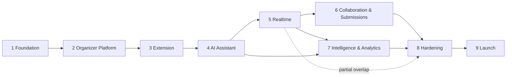

# Project Plan — AI-Powered IDE-Native Hackathon Platform

Master plan segregating the project into phases, from empty repo to production launch.

- **Scope source:** `features.md`
- **Architecture reference:** `architecture.md` (Fastify API, Next.js dashboard, VS Code extension, Postgres + pgvector, Redis, OpenAI API)
- **MVP detail:** `build-plan.md` (Phases 1–4 here map to it)
- **Extension detail:** `extension-plan.md` (VS Code extension milestones E1–E6, mapped to master phases)

Each phase has an **exit criterion** — a concrete, testable statement of done. A phase isn't complete until its exit criterion passes.

---

## Phase Overview

| Phase | Name | Outcome | Status |
|---|---|---|---|
| 1 | Foundation | Monorepo, infra, schema, skeletons deployed | ✅ done |
| 2 | Organizer Platform | Content in: dashboard + API complete | ✅ done |
| 3 | Participant Extension | Content out: full event visible in VS Code | ✅ done |
| 4 | AI Assistant | RAG Q&A with citations in the IDE | ✅ done |
| 5 | Realtime Layer | Instant announcements in IDE + Discord/Telegram broadcast | ✅ done |
| 6 | Collaboration & Submissions | Teams, chat, mentor access, in-IDE submission | ✅ done |
| 7 | Intelligence & Analytics | Auto-FAQ, summaries, recommendations, organizer insights | ✅ done (recommendations + digests deferred) |
| 8 | Production Hardening | Security, scale, observability, CI/CD | 🟡 local hardening done (see Deferred) |
| 9 | Launch | Marketplace release, pilot event, feedback loop | 🟡 launch-ready (publish + pilot pending) |

**Phase 9 done locally:** bundled `.vsix` (esbuild, configurable `hackos.*` endpoint settings), Marketplace listing README + LICENSE, demo seeder (`scripts/seed-demo.mjs`), installed and verified. **Pending (needs accounts):** Marketplace/Open VSX publisher + publish, cloud deploy of services, real pilot event.

**Phase 8 deferred to pre-launch (needs cloud accounts/infra):** Postgres RLS policies (membership checks enforced in code today; tenant-isolation test in `scripts/test-tenant-isolation.mjs` guards it), OpenTelemetry + Sentry wiring, PgBouncer, Dockerfiles + deploy pipeline, OpenAI spend alerts, privacy policy / retention automation.

Phases 1–5 are strictly sequential (each builds on the last). Phases 6 and 7 can run in parallel once 5 is done. Phase 8 runs partly in parallel with 6–7 and gates Phase 9.

---

## Phase 1 — Foundation

**Goal:** every service exists, deploys, and talks to its dependencies.

### Workstreams
- **Repo:** pnpm monorepo — `apps/web`, `apps/api`, `apps/ai`, `apps/gateway`, `apps/workers`, `extension/`, `packages/shared` (types, SDK), `packages/db` (schema, migrations)
- **Infra (dev):** docker-compose with Postgres + pgvector, Redis, MinIO
- **Infra (cloud):** managed Postgres, Redis, object storage provisioned; container platform + Vercel projects created; `OPENAI_API_KEY` in secret manager (server-side only)
- **Database:** initial migrations — `organizations`, `hackathons`, `users`, `invite_codes`, `resources`, `resource_chunks` (vector), `announcements`, `timeline_items`, `teams`, `team_members`, `submissions`, `qa_logs`
- **Auth spine:** sign-up/sign-in for organizers AND participants — email+password and OAuth (GitHub/Google) on web, OAuth device flow for the extension; JWT issue/refresh, RBAC claims (organizer / mentor / participant); invite-code redemption binds a signed-in user to a hackathon
- **DB additions:** `integrations` and `integration_deliveries` tables (Discord/Telegram) in the initial schema
- **Skeletons:** Fastify API with OpenAPI generation; Next.js app with auth pages; extension scaffold with activation + empty sidebar; CI running typecheck + tests on every PR

**Exit criterion:** `docker compose up` gives a working local stack; a deployed hello-world of every service; one migration applied in staging.

---

## Phase 2 — Organizer Platform (content in)

**Goal:** organizers can fully configure and operate an event from the dashboard.

### Workstreams
- **Event management:** create/edit hackathon, venue + description, timeline editor, invite-code generation (scoped, expirable, revocable)
- **Content management:** CRUD for problem statements, docs (markdown editor + file upload to S3 via presigned URLs), resource links, sponsor resources & APIs, judging criteria, submission guidelines, FAQs
- **Announcements:** compose, priority levels, edit/retract
- **Integrations UI:** "Connect Discord" (bot invite + channel selection) and "Connect Telegram" (bot + one-time linking code) settings pages, per-integration filters, connection status + delivery log views (broadcast itself lands in Phase 5)
- **Versioning:** `resources.version` increments on edit (feeds Phase 4 re-ingestion)
- **API:** all endpoints scoped by `hackathon_id`, cursor pagination, idempotency keys on mutations, RLS policies active
- **SDK:** typed client generated from OpenAPI, published to `packages/shared`

**Exit criterion:** an organizer creates a complete demo event (docs, rules, timeline, sponsor APIs, announcements) using only the dashboard; everything retrievable via the typed SDK.

---

## Phase 3 — Participant Extension (content out)

**Goal:** a participant's entire event lives in VS Code.

### Workstreams
- **Join flow:** invite-code entry → JWT in SecretStorage → connected state
- **Sidebar:** tree view — Problem Statements, Docs & Resources, Announcements, Timeline, Sponsor APIs, FAQs
- **Reader:** markdown rendered in webview/editor tabs; links resolve
- **Sync:** local cache in workspace storage, `since`-cursor delta sync, manual refresh + background polling
- **Ambient info:** status bar with event name + next deadline countdown

**Exit criterion:** end-to-end loop — organizer publishes on web, participant sees it in VS Code (≤ polling interval), including offline reading of cached content.

---

## Phase 4 — AI Assistant

**Goal:** cited, event-grounded Q&A inside the IDE. The differentiator.

### Workstreams
- **Ingestion pipeline (workers):** on content create/update → BullMQ job → normalize (markdown; PDF → text) → chunk by heading with overlap → embed (`text-embedding-3-small`, batch endpoint) → upsert to pgvector with `{hackathon_id, resource_id, section, version}`; atomic tombstoning of stale versions
- **Query path (AI service):** embed question → hybrid retrieval (vector + full-text, RRF, mandatory `hackathon_id` filter) → `gpt-4o` with strict grounding prompt (answer only from context, cite per claim, refuse when uncovered) → SSE streaming
- **Semantic cache:** Redis embedding-similarity cache per event on recent Q&A
- **Extension chat panel:** webview chat, streamed answers, clickable citations that open source resources
- **Semantic search:** command palette + sidebar search reusing retrieval
- **Logging:** every Q&A into `qa_logs` (consented) — feeds Phase 7
- **Safety:** retrieved chunks treated as data (prompt-injection defense); cross-tenant retrieval leak test in CI

**Exit criterion:** 20-question eval set over the demo event answers correctly with valid citations; cross-tenant leak test passes; cached repeat questions answer in <500ms.

---

## Phase 5 — Realtime Layer

**Goal:** zero missed announcements; the extension feels live.

### Workstreams
- **Gateway:** stateless WebSocket service, JWT auth, `hackathon:{id}` channels, Redis pub/sub backplane, heartbeat + drain-on-deploy
- **Events:** `announcement.created`, `resource.updated`, `deadline.changed` published by the API
- **Extension:** subscribe on join, auto-reconnect with backoff, replay missed events via `/sync?since=` on reconnect; polling retained as fallback
- **UX:** native VS Code notification for high-priority announcements; sidebar badges for the rest
- **AI tie-in:** "Summarize today's announcements" (`gpt-4o-mini`)
- **Discord/Telegram broadcast:** notification worker fans every announcement out to connected channels (formatted embed/message, priority marker, deep link back to the platform); retries honoring rate limits; failures mark the integration `broken` on the dashboard and log to `integration_deliveries`

**Exit criterion:** announcement published → notification in a connected extension in <2s AND the message appears in linked Discord + Telegram channels; kill the gateway mid-demo → extension recovers and replays missed events without user action.

---

## Phase 6 — Collaboration & Submissions

**Goal:** teams work and ship without leaving the IDE.

### Workstreams
- **Teams:** create/join team, member list in sidebar
- **Team chat:** channel per team over the existing gateway; history in Postgres; unread indicators
- **Community & mentors:** event-wide channel; mentor availability status; ask-a-mentor thread flow
- **Submissions:** in-IDE form (repo URL, description, demo link) → API with deadline enforcement (server-side clock); organizer dashboard submission list + export
- **Moderation basics:** organizer can pin/delete messages

**Exit criterion:** a team forms, chats, receives a mentor reply, and submits a project entirely from VS Code; the submission appears on the organizer dashboard.

---

## Phase 7 — Intelligence & Analytics

**Goal:** the platform gets smarter with use; organizers see value.

### Workstreams
- **Auto-FAQ:** cluster `qa_logs` (`gpt-4o-mini`) → draft FAQ → organizer one-click publish → auto-ingested into RAG
- **Recommendations:** surface relevant resources from workspace context (opt-in)
- **Organizer analytics:** participant activity, most-asked questions, unanswered-question alerts, announcement reach
- **Digests:** scheduled event summaries for organizers

**Exit criterion:** after a simulated event day, the dashboard shows accurate analytics and a publishable auto-generated FAQ that then answers via the assistant.

---

## Phase 8 — Production Hardening

**Goal:** ready for a real event with a few thousand participants. Runs in parallel with 6–7 where possible; gates launch.

### Workstreams
- **Security:** RLS audit, rate limiting at gateway, sponsor-key encryption (KMS), audit log on organizer mutations, dependency scanning, pen-test pass on auth + invite flow
- **Scale validation:** load test the burst path (1 announcement → 5k sockets → 1k AI questions); autoscaling policies tuned; PgBouncer in place
- **Cost controls:** per-user AI rate limits, semantic-cache hit-rate monitoring, OpenAI spend alerts and hard budget caps
- **Observability:** OpenTelemetry traces API→queue→worker→OpenAI, dashboards, alerting, Sentry in all services + extension
- **Delivery:** blue-green/rolling deploys, gateway socket draining, expand-and-contract migration discipline, staging seeded with a full demo event
- **Compliance basics:** privacy policy, data retention for `qa_logs` and chat, event archival/export

**Exit criterion:** load test passes at 5k concurrent sockets with p95 AI answer <6s and zero dropped announcements; on-call runbook exists; staging → prod deploy is one command.

---

## Phase 9 — Launch

**Goal:** real users, real event.

### Workstreams
- **Distribution:** VS Code Marketplace + Open VSX publication, versioned `/v1` API frozen
- **Onboarding:** organizer docs, participant quick-start, demo video
- **Pilot:** run one real (or dogfood) hackathon end-to-end; embed with organizers during the event
- **Feedback loop:** in-extension feedback command, triage board, hotfix channel
- **Post-event:** archival flow verified (export + cold storage), retro → backlog for v2

**Exit criterion:** one pilot event completed with real participants; extension live on the Marketplace; retro documented.

---

## Dependency Map

## Standing Rules (all phases)

- Shared types in `packages/shared` are the single source of truth; no hand-written API types in clients.
- Every mutation is idempotent; every list endpoint is cursor-paginated.
- `hackathon_id` scoping is enforced in code **and** RLS — both, always.
- AI answers must cite or refuse; no uncited claims ship.
- Polling fallback is never removed — realtime is an enhancement.
- Each phase's exit criterion is verified before the next phase starts (parallel phases excepted per the dependency map).
